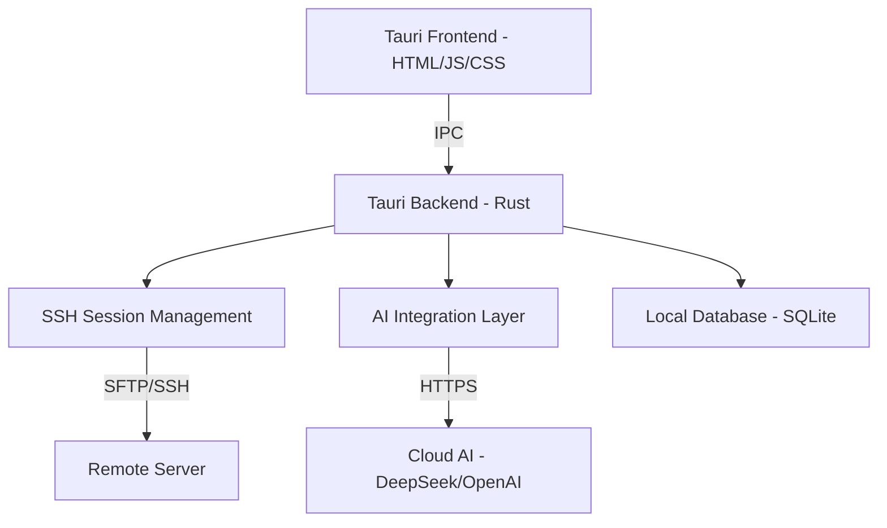

# AI-Term-Shell 需求开发文档

## 1. 项目概述
### 1.1 目标
开发一款集成 AI 功能的跨平台 SSH 客户端和终端模拟器。在保留传统工具（如 FinalShell、Termius）的核心功能（SSH、SFTP、系统监控）基础上，深度集成 LLM（如 DeepSeek、OpenAI）提供智能辅助。

### 1.2 核心价值
*   **低门槛**：自然语言转化为复杂的 Linux 命令。
*   **高效率**：运行报错时 AI 自动诊断并提供修复建议。
*   **易理解**：一键解释晦涩难懂的 Shell 脚本或长命令。
*   **跨平台**：基于 Tauri 实现 Windows、macOS 和 Linux 的统一体验。

---

## 2. 核心功能需求

### 2.1 基础终端功能
*   **多协议支持**：SSH、Telnet、本地终端（PowerShell, Bash, Zsh）。
*   **会话管理**：支持分组存储服务器信息，支持快速连接。
*   **多标签/分屏**：支持水平和垂直分屏。
*   **SFTP 文件管理**：
    *   可视化的文件上传、下载、删除、重命名。
    *   文件编辑器：支持语法高亮，远程保存。
*   **实时监控**：在侧边栏或顶部显示远程服务器的 CPU、内存、网络、IO 监控信息。

### 2.2 AI 增强功能
*   **自然语言转命令 (NL-to-Command)**：
    *   用户输入：“查找当前目录下大于 100M 的文件并按大小排序”。
    *   AI 生成：`find . -type f -size +100M -exec ls -lh {} + | sort -rh -k 5`。
*   **智能报错诊断**：
    *   当命令退出状态码非 0 时，自动捕获 stderr 内容并分析原因，给出修复方案（如：“权限不足，请尝试添加 sudo” 或 “依赖缺失，请运行 apt install...”）。
*   **命令解释器**：
    *   选中文中的一段命令或脚本，点击“解释”，AI 拆解说明每个参数的含义。
*   **智能补全**：
    *   基于上下文和当前服务器环境，提供更智能的命令预测。

### 2.3 AI 接入能力
*   **多引擎切换**：支持 OpenAI (GPT-4), DeepSeek, Anthropic (Claude) 等云端 API。
*   **本地模型支持**：支持通过 Ollama 接入本地运行的模型（保护隐私）。
*   **提示词管理**：允许用户自定义系统级 Prompt。

---

## 3. 技术栈
*   **前端框架**：Vue 3 或 React (配合 Vite)。
*   **桌面框架**：Tauri v2。
*   **后端语言**：Rust。
*   **核心库**：
    *   `tokio-ssh2` / `russh`：用于 SSH 连接。
    *   `xterm.js`：前端终端渲染引擎。
    *   `reqwest` / `async-openai`：用于 AI API 交互。
*   **本地数据库**：SQLite。
    *   **关键要求**：使用 `rusqlite` 并开启 `bundled` 特性，确保不依赖系统动态库。
*   **UI/UX 设计**：
    *   现代、深色系、毛玻璃效果（Glassmorphism）。
    *   响应式布局。

---

## 4. 系统架构与设计

### 4.1 架构图

---

## 5. 开发路线图 (Roadmap)

### 第一阶段：基础设施 (MVP)
1.  初始化 Tauri + Rust 项目。
2.  实现基础 SSH 连接和 xterm.js 渲染。
3.  建立 SQLite 数据库，实现服务器列表的 CRUD（增删改查）。

### 第二阶段：可视化增强
1.  实现 SFTP 基础功能。
2.  加入 CPU/内存等系统资源实时监视图表。
3.  实现可自定义的终端主题。

### 第三阶段：AI 深度集成
1.  对接 DeepSeek API 实现第一个“智能命令框”。
2.  实现错误自动捕获与诊断功能。
3.  增加命令选中解释划词功能。

### 第四阶段：优化与发布
1.  跨平台打包测试（Windows, macOS ARM/Intel）。
2.  数据加密存储优化。
3.  社区常用命令库订阅功能。

---

## 6. 合规性与安全
*   **凭据存储**：服务器密码和密钥路径必须强加密存储，优先使用系统钥匙串 (Keychain/Credential Manager)。
*   **隐私保护**：AI 请求中涉及的敏感信息应提供脱敏选项。详细参阅 [安全与隐私设计规范](file:///Users/lixu/code/ai/lidayeiTerm/docs/security_and_privacy.md)。
*   **AI 策略**：详细参阅 [AI 上下文管理与提示词策略](file:///Users/lixu/code/ai/lidayeiTerm/docs/ai_context_strategy.md)。
