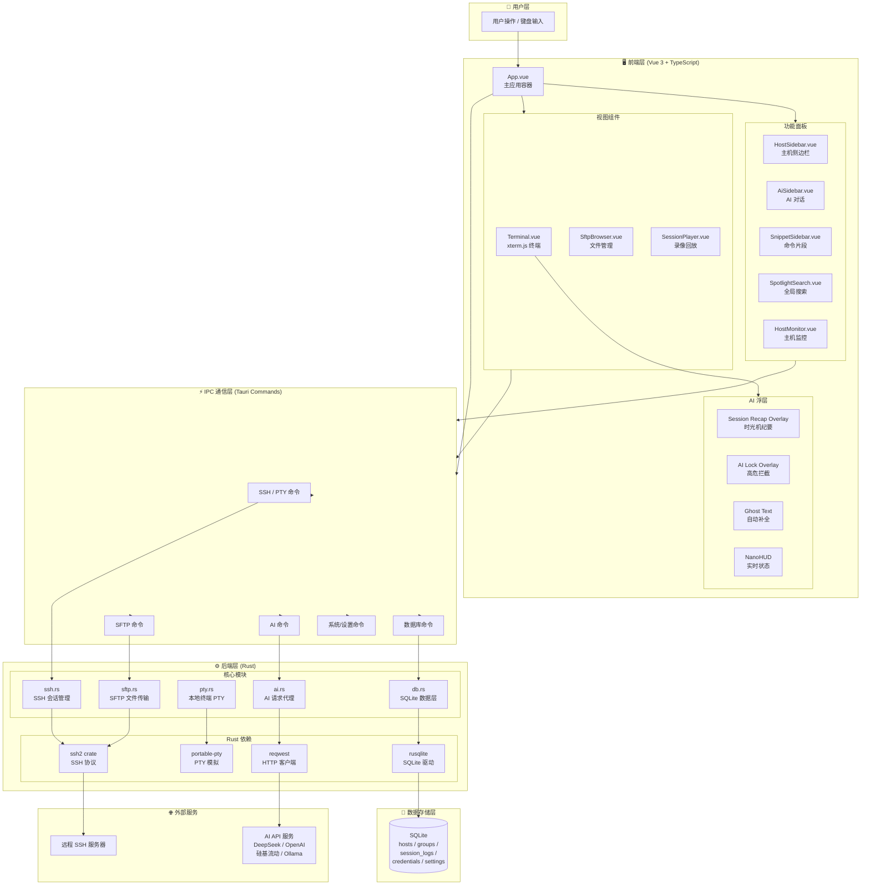
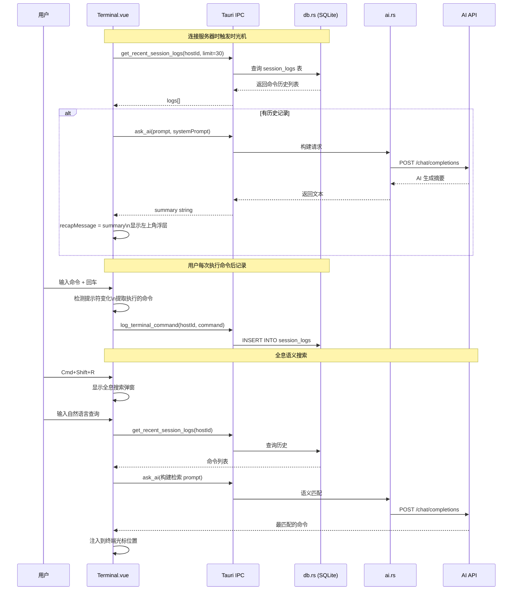
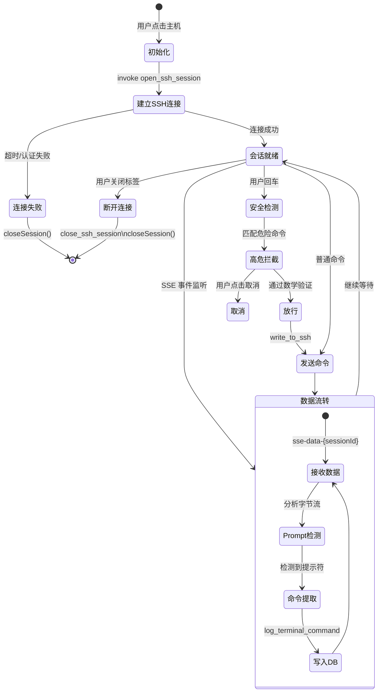
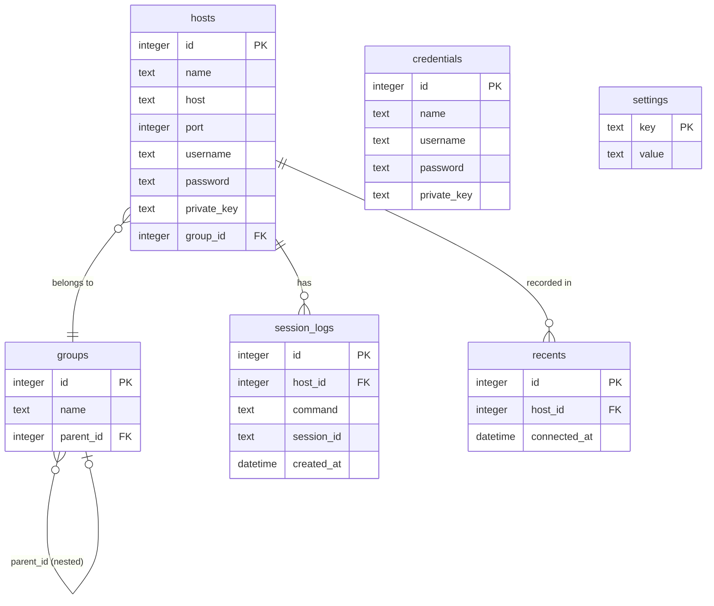
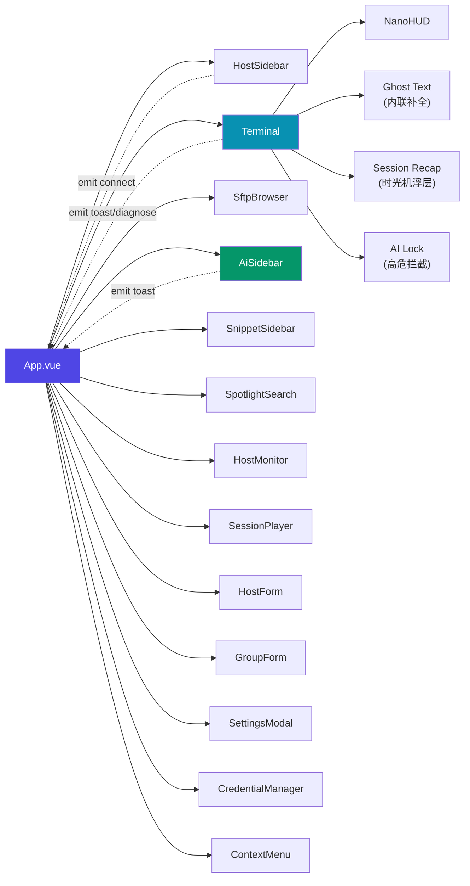
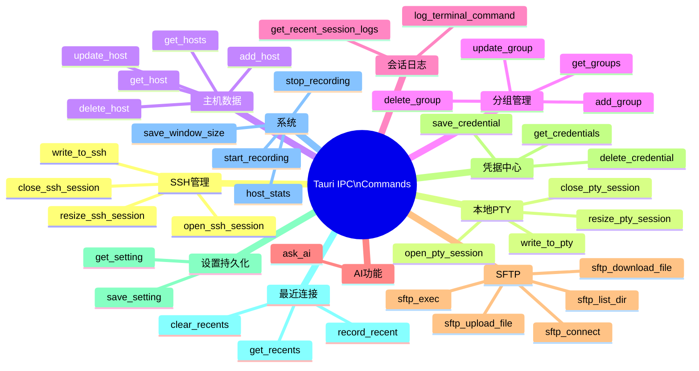

# Nixu Terminal 系统架构图

---

## 一、整体分层架构

---

## 二、AI 功能数据流

---

## 三、SSH 会话生命周期

---

## 四、数据库表结构

---

## 五、前端组件依赖关系

---

## 六、Tauri IPC 命令清单

---

*生成时间：2026-03-20 | Nixu Terminal 系统架构文档 v1.0*
